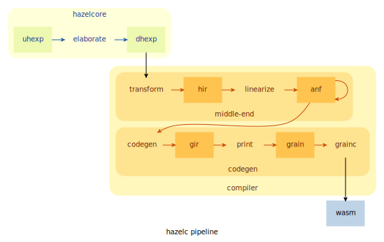

# PHI 14: Hazel Compiler

## Motivation

Right now, Hazel has only a simple evaluator, but not a compiler that can output fast, optimized,
cross-platform executables. This PHI proposes such a compiler.

This comes as a two-step process in implementation:

1.  The compilation of [complete programs](#complete-programs).
2.  The compilation of [*incomplete* programs](#incomplete-programs).

## Overview

The compiler will be based on [Grain](https://grain-lang.org/), a functional programming language
that compiles to [WebAssembly](https://webassembly.org/).

### Why Grain?

Grain, being a functional programming language itself, possesses features that allow for relatively
easy translation from Hazel code, such as pattern matching and garbage collection. Crucially, it
also targets WebAssembly.

### Why WebAssembly?

Though designed for running native-speed programs in the web, WebAssembly is portable open standard
that aims to support any operating system or execution environment. There are already a number of
runtimes targeting server or desktop environments, such as
[wasmer](https://github.com/wasmerio/wasmer) and
[wasmtime](https://github.com/bytecodealliance/wasmtime). By targeting WebAssembly, Hazel can take
advantage of these and run in a variety of different environments.

## Implementation

### Complete programs

Complete Hazel programs will be compiled directly into Grain's primitives and require no extra
machinery to execute.

#### Unresolved issues

-   *Pattern matching:* Due to some of Grain limitations, there are some cases of complete programs
    that it cannot handle, such as pattern matching with number/boolean literal patterns.
-   *Lambda abstractions:* Currently not sure how to determine if a given lambda can be determined
    to be non-indeterminate.

### Incomplete programs

For incomplete programs, the compiler will insert code to construct the syntax trees of
indeterminate forms during runtime.

This is done by writing a separate "stdlib" modules that will be linked to during Grain compilation.
As opposed to directly calling Grain's primitive operators, we will mask these with functions that
will check for indeterminate expressions (see [below](#memory-representation)).

In the future, optimizations in code generation will allow for the direct application of Grain's
primitive operators when it is guaranteed that a sub-expression has no holes.

There remain many unsolved problems in this area, namely [pattern matching](#pattern-matching) and
[GC integration](#garbage-collection).

#### Hole environments

For now, hole environments will be stored in the runtime syntax tree as a `Map` from variables names
to syntax tree nodes.

#### Casts

**TODO**: Sync with Hilbert on this topic (embedding-projection pairs?)

In the future, we will switch to coercions à la [Grift](https://github.com/Gradual-Typing/Grift).

#### Pattern matching

This is still an unresolved question.

#### Memory representation

Grain currently has [three types of stack
values](https://github.com/grain-lang/grain/blob/main/docs/contributor/data_representations.md):
simple numbers, pointers (to heap values), and constants. Except for simple numbers, whose least
significant bit is always `1`, these stack values are tagged using the three least significant bits,
where `000` indicates a pointer, `010` indicates a stack-allocated character, and `110` indicates a
constant. Left as "reserved" is the tag `100`.

We will use the tag `010` to represent *pointers to indeterminate expressions* that live on the heap
as syntax trees. The syntax tree will be represented by an `enum` type similar to `DHExp.t`. The
`Hazel` module's functions will manually examine value's tag and perform the correct operation
accordingly.

##### Garbage collection

How this change plays with the existing garbage collection is unclear.

### Architecture

The compilation pipeline consists of a few separate stages.

#### `transform` : high-level transformation

The elaborated DHExp is converted into a similar high-level intermediate representation with a
number of transformations:

-   Recursive functions definitions are resolved into a `LetRec` construct
-   The types of bound variables are resolved and stored.

#### `linearise` : linearisation

Linearisation converts the high-level intermediate representation into linearised ANF. On this form,
optimizations may be performed in the future, if desired.

-   Whether a given expression has any possibly indeterminate sub-expressions is computed and
    stored.

#### `codegen` : code generation

Finally, the ANF program is compiled into WebAssembly via a back-end code generator.

For now, the only back-end code generator is one that emits Grain and shells-out to the Grain
compiler: a straight-forward conversion transforms ANF into an IR form that mimics a subset of
Grain. Following pretty printing, `grainc` is called to produce a wasm executable.

## Progress

-   [ ] Complete programs
    -   [ ] case expression with number or boolean literal patterns
-   [ ] Incomplete programs
    -   [ ] Hole environments
    -   [ ] Cast handling
    -   [ ] Pattern matching with holes
-   [ ] Program analysis and optimization
